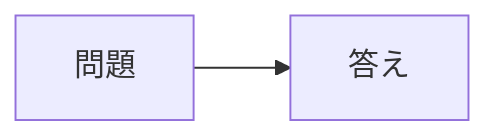

# 単語帳

Google Sheets をデータベースとして使う、個人用のシンプルな単語帳 Web アプリです。

Mac と iPhone で同じ Google アカウントから同じ Web アプリを開けば、カード・正誤回数・復習日・苦手情報が同じ Google Sheet に保存されるため、そのまま同期されます。

## 主な機能

- CSV でカードを一括登録
- `type` 列をデッキ名として利用
- 起動時にデッキを選択して別々に学習
- 複数の通常デッキを参照する「まとめデッキ」で横断学習
- デッキ名の変更時に、そのデッキのカードもまとめて移動
- デッキを削除し、所属カードは未分類へ移動
- Mac / iPhone で同じ学習状態を共有
- 正解 / 不正解を記録
- Leitner 方式による復習スケジュール
- 今日間違えた問題だけ復習
- 今日追加した問題数をデッキ画面に表示
- 今日追加した問題だけをまとめて学習
- 苦手な問題を重点復習
- 要確認フラグ
- アプリ上から問題・答え・メモを編集
- ダークモード / ライトモード対応
- 外部データベース不要
- ホームのカード・集計・今日の学習数を一度に取得
- デッキ一覧の集計を45秒キャッシュし、アプリからの変更時に破棄
- Mermaid 図があるメモだけ表示時に Mermaid ライブラリを読み込み

この fork は日本語での学習用途に絞った版です。元リポジトリに含まれていたオランダ語・中国語向けスターターデッキ、多言語音声読み上げ、学習言語設定、Soak プレイヤー、利用状況を送る更新チェック機能は削除しています。

## 累乗の書き方

カードの問題・答え・メモに `IPv6はIPv4の \(2^{96}\) 倍` と入力すると、学習画面では `96` が上付きで表示されます。`2^{96}` や `x^2` も使えます。追加・編集画面では入力欄の下に表示プレビューが出ます。入力欄には保存する元の文字列がそのまま残ります。

## 問題文にコードを入れる

問題欄でコードを3つのバッククォートで囲むと、学習画面と追加・編集画面のプレビューに、改行と字下げを保ったコードブロックとして表示されます。言語名は省略できます。シートには入力した文字列をそのまま保存します。

````text
次の相関副問合せは何を求める？
```sql
SELECT 従業員コード
FROM 従業員 X
WHERE NOT EXISTS (
    SELECT *
    FROM 従業員 Y
    WHERE X.従業員コード = Y.上司
);
```
````

## メモに Mermaid 図を入れる

メモ欄で `mermaid` のコードブロックを使うと、学習画面と追加・編集画面のプレビューに図が表示されます。シートには入力した文字列をそのまま保存します。

````text
補足説明


````

図の表示にはインターネット接続が必要です。Mermaid を読み込めない場合や記法に誤りがある場合は、メモに元のコードを表示します。

## 仕組み

```text
Mac のブラウザ ─┐
                  ├─ Google Apps Script ─ Google Sheets
iPhone Safari ───┘
```

端末同士が直接同期するのではなく、両方が同じ Google Sheet を読み書きします。

## デッキの分け方

`cards` シートの `type` 列をデッキ名として扱います。

たとえば次のように登録すると、アプリ起動時に「A1」と「セキスペ」が別々のデッキとして表示されます。

```csv
id,type,front_side,back_side,notes,box,due,last_seen,right,wrong,added,flag,exclude,last_wrong
1,A1,IRRとは？,内部収益率,,,,,,,,,,
2,A1,NPVとは？,正味現在価値,,,,,,,,,,
3,セキスペ,Forward Secrecyとは？,長期鍵が漏えいしても過去の通信内容を復号しにくくする性質,,,,,,,,,,
4,セキスペ,EAP-TLSとは？,クライアント証明書とサーバ証明書を用いるEAP方式,,,,,,,,,,
```

アプリでは概ね次のように表示されます。

```text
デッキを選択

A1                  616枚
今日の復習 20 ・ 未学習 100 ・ 今日の間違い 3

セキスペ            215枚
今日の復習 10 ・ 未学習 40 ・ 今日の間違い 2
```

選択後の「通常学習」「今日間違えた問題だけ復習」「苦手な問題を重点復習」は、すべて選択したデッキ内だけで行われます。

`type` が空欄のカードは「未分類」デッキにまとめられます。

デッキ一覧の集計は45秒間再利用します。アプリでカードの追加・編集・削除・解答、デッキの作成・変更・削除を行うと、次の取得で最新の一覧を表示します。Google Sheetsで直接編集したりCSVを取り込んだりした後は、デッキ一覧の「更新」を押すとすぐ再取得できます。学習用のカード取得では、一覧のキャッシュを使わずシートを読み込みます。

空欄のカードIDは初回取得時に自動付与し、空IDが連続する区間ごとに一括保存します。既存IDと空行は書き換えません。

デッキ一覧の各行にある鉛筆アイコンから名前を変えると、`decks` シートの登録名と、そのデッキに属する全カードの `cards.type` が更新されます。空デッキも変更できます。「未分類」を変更すると、`type` が空欄のカードを新しい名前のデッキへ移動します。既存のデッキと同じ名前には変更できません。

デッキ一覧のゴミ箱アイコンでは確認後にデッキの登録を消し、所属カードの `type` を空欄にして「未分類」へ移します。カードの内容と学習履歴は残ります。空デッキも削除できます。「未分類」デッキは削除できません。

## まとめデッキ

「新規デッキを作成」で種類を「まとめデッキ」に切り替え、名前と参照する通常デッキを2つ以上選択します。未分類や空の通常デッキも選択できます。まとめデッキを別のまとめデッキの参照先にすることはできません。

カードはコピーしません。学習時に参照先のカードをまとめて取得するため、元デッキへのカード追加・編集が次の取得時に反映されます。正誤回数・復習日・間違い・苦手マークは元カードと共有します。各学習モードは参照先全体に現在の出題ルールを適用し、デッキごとに出題数を均等にはしません。同じカードIDを重複して出題しません。

- デッキ一覧には「まとめ」と参照先を表示し、カード数と復習対象数を合算します。
- 学習画面には出題中のカードの元デッキ名を表示します。
- 「今日の学習数」は参照先の解答数の合計です。元デッキから解答した分も含み、解答1回を二重には記録しません。
- カードの追加時には、参照先のどの通常デッキへ保存するかを選択します。
- 編集・苦手マーク・削除は元カードに反映します。まとめデッキからのカード削除は、他のデッキからも消えることを確認してから行います。
- 一覧の鉛筆アイコンで名前と参照先を変更できます。編集後の参照先が1つや0個でもまとめデッキを残し、0個なら出題しません。
- 元デッキの名前を変更しても固定IDで参照が続きます。未分類を名前付きデッキへ移す場合も、既存の参照は移動先に引き継ぎます。
- 元デッキを削除すると、まとめデッキの参照先からも外れます。元カードは未分類へ移り、未分類を別途参照している場合だけ引き続き対象になります。
- まとめデッキ自体の削除では参照設定だけを消し、元デッキ・カード・解答履歴を残します。
- 未送信の解答がある場合は、参照範囲が重なるデッキでも同期完了を待ってから最新の問題を取得します。

`cards` シートのカード行は増やさず、`decks` シートに設定を保存します。既存の `type, created` 列を維持し、初回のデッキ一覧取得時に通常デッキへ固定IDを付与します。

| 列 | 内容 |
|---|---|
| `type` | デッキ名 |
| `created` | 作成日 |
| `deck_id` | 名前変更で変わらない固定ID |
| `kind` | `normal`（通常）または `combined`（まとめ） |
| `source_deck_ids` | 参照先の固定IDをJSON配列で保存。通常デッキは `[]` |

カードの所属は引き続き `cards.type` で管理します。まとめデッキ名をカードの `type` に直接入力しないでください。アプリで元デッキの名前を変更すると、カードの所属と参照関係を維持して更新します。

## セットアップ

### 1. clone

```bash
git clone https://github.com/ryusuke2003/flashcards.git
cd flashcards
```

### 2. clasp

```bash
npm install -g @google/clasp
clasp login
```

### 3. Sheet に紐づく Apps Script プロジェクトを作成

```bash
clasp create --type sheets --title "単語帳" --rootDir .
git checkout -- appsscript.json
```

### 4. デプロイ

```bash
clasp push --force
clasp deploy --description "日本語版"
```

表示された Deployment ID を使って Web アプリを開きます。

```text
https://script.google.com/macros/s/<DEPLOYMENT_ID>/exec
```

デフォルトは `access: MYSELF` なので、自分の Google アカウントだけが利用できます。

## iPhone で使う

Safari で Web アプリを開き、共有メニューから「ホーム画面に追加」を選びます。

## CSV の取り込み

アプリ自身は CSV をアップロードしません。Google Sheets のインポート機能を使います。

1. Web アプリから Google Sheets を開く
2. `cards` シートを開く
3. ファイル → インポート → アップロード
4. CSV を選択
5. 新規なら現在のシートを置換、既存カードを残すなら現在のシートに追加
6. 「テキストを数値、日付、数式に変換する」はオフ

6 はセキュリティ上も重要です。CSV 内の `=...` などが Google Sheets の数式として解釈されるのを防ぎます。アプリ上から編集した値についても、数式として評価されないプレーンテキストとして保存します。

### 必須ヘッダー

```csv
id,type,front_side,back_side,notes,box,due,last_seen,right,wrong,added,flag,exclude,last_wrong
```

### 最小例

```csv
id,type,front_side,back_side,notes,box,due,last_seen,right,wrong,added,flag,exclude,last_wrong
1,A1,IRRとは？,内部収益率,,,,,,,,,,
2,セキスペ,ARPの役割は？,IPv4でIPアドレスからMACアドレスを調べること,同一L2ネットワーク内で利用,,,,,,,,,
```

`decks/template.csv` も雛形として使えます。

## 学習モード

通常学習では、選択中のデッキについて、復習期限が来たカードと未学習カードを出題します。

通常デッキ・まとめデッキとも、すべての学習モードで抽出した問題の出題順をランダムにします。通常学習と「今日追加した問題だけ学習」は解答回数の少ないカードを優先して最大50問を選び、その後に出題順をシャッフルします。「苦手な問題を重点復習」も苦手度の高いカードを最大20問選んでから、ランダムな順序で出題します。

「今日復習するべき問題」では、選択中のデッキの復習期限が来たカード全体から、毎回ランダムな順序で最大50問を出題します。

- 正解: box を1段階上げる
- 不正解: box 1へ戻す
- box 1〜5 の復習間隔: 1 / 2 / 4 / 8 / 16 日

「今日追加した問題だけ学習」では、その日に追加したカードだけをまとめて出題します。未学習カードは通常どおり学習スケジュールを進め、すでに学習済みのカードをもう一度解く場合はスケジュールを変更しない練習扱いにします。

「今日間違えた問題だけ復習」と「苦手な問題を重点復習」も、選択中のデッキ内だけを対象にします。これらは通常スケジュールを変更しない練習モードです。

## セキュリティ上の方針

- Web アプリのアクセス範囲は `MYSELF`
- `@OnlyCurrentDoc` で Spreadsheet 権限をこの単語帳のシートに限定
- `XFrameOptionsMode.ALLOWALL` を使用しない
- カード本文やデッキ名は `textContent` で表示し、HTMLとして解釈しない
- 外部 JavaScript / CDN を読み込まない
- 編集したカード本文は `RichTextValue` でプレーンテキストとして保存し、`=...` を数式として実行させない
- CSV 取り込み時は「テキストを数値、日付、数式に変換する」をオフにする
- 元リポジトリにあった匿名利用状況の送信・更新チェックを削除

## 更新

```bash
clasp push --force
clasp redeploy <DEPLOYMENT_ID> --description "update"
```

## ライセンス

MIT License
